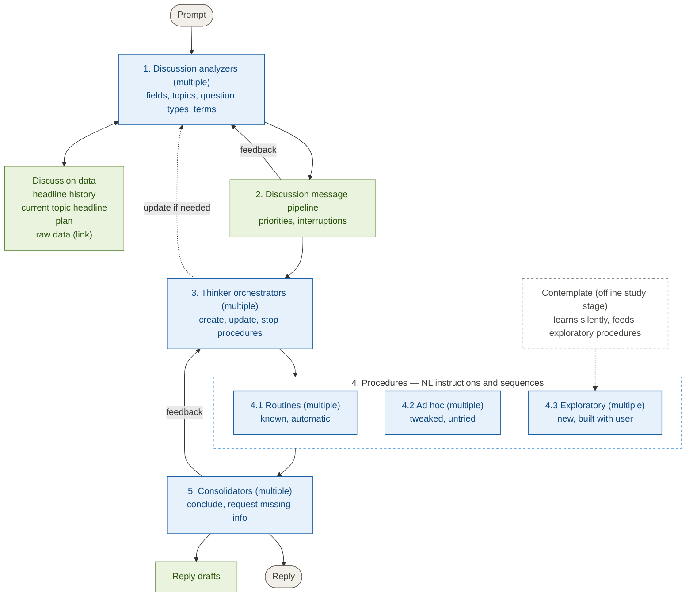

<!-- architecture.md — overBrain — v1.0.0.t1 -->

# overBrain — architecture (draft)

```mermaid
flowchart TD
    P([Prompt])

    A["1. Discussion analyzers (multiple)<br/>fields, topics, question types, terms"]
    D["Discussion data<br/>headline history<br/>current topic headline<br/>plan<br/>raw data (link)"]
    M["2. Discussion message pipeline<br/>priorities, interruptions"]
    T["3. Thinker orchestrators (multiple)<br/>create, update, stop procedures"]

    subgraph PR["4. Procedures — NL instructions and sequences"]
        R["4.1 Routines (multiple)<br/>known, automatic"]
        H["4.2 Ad hoc (multiple)<br/>tweaked, untried"]
        E["4.3 Exploratory (multiple)<br/>new, built with user"]
    end

    C["5. Consolidators (multiple)<br/>conclude, request missing info"]
    RD["Reply drafts"]
    REPLY([Reply])
    CT["Contemplate (offline study stage)<br/>learns silently, feeds exploratory procedures"]

    P --> A
    A <--> D
    A --> M
    M -->|feedback| A
    M --> T
    T -.->|update if needed| A
    T --> PR
    PR --> C
    C --> RD
    C -->|feedback| T
    C --> REPLY
    CT -.-> E

    classDef blue fill:#E6F1FB,stroke:#185FA5,color:#0C447C
    classDef green fill:#EAF3DE,stroke:#3B6D11,color:#27500A
    classDef gray fill:#F1EFE8,stroke:#5F5E5A,color:#444441
    classDef offline fill:none,stroke:#888780,stroke-dasharray:4 4,color:#444441

    class A,T,R,H,E,C blue
    class D,M,RD green
    class P,REPLY gray
    class CT offline
    style PR fill:none,stroke:#378ADD,stroke-dasharray:4 4
```